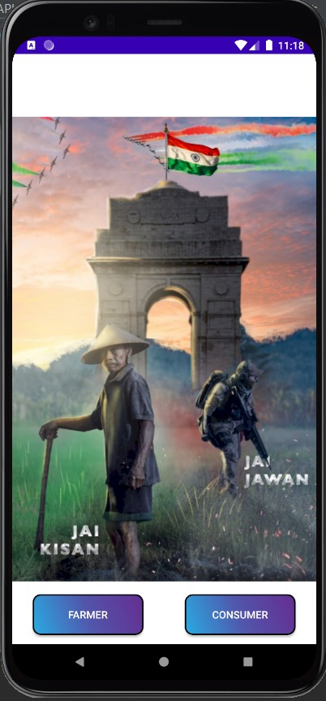
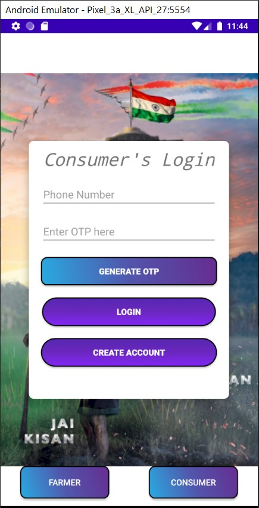
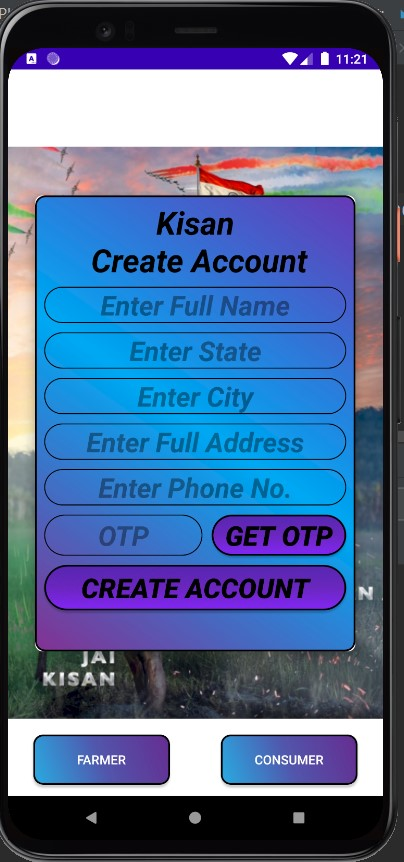
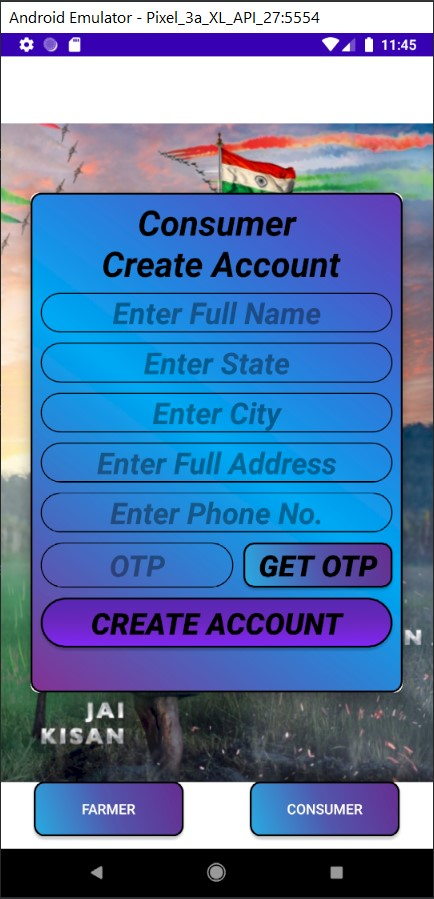
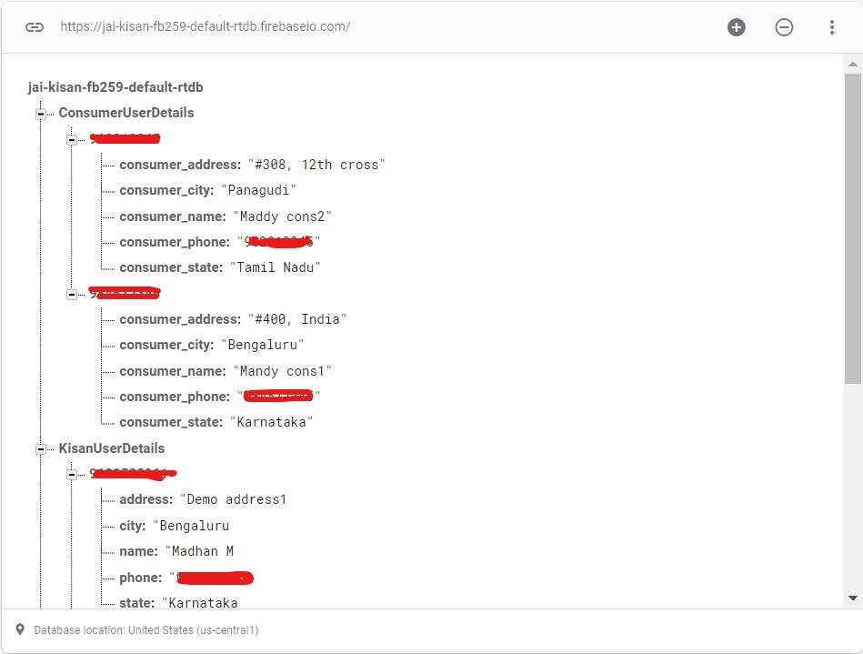

# Jai-kisan-farmers-networking-app
  This Application focuses on building an online profile for farmers, showcase their inventory online, and attract end-consumers and sell their goods Online as a side hustle.
  End-consumers and entrepreneurs based on agriculture goods and services can get direct contact with farmers and promote their business and generate profit.  
  ***Tools used: Android Studio, Firebase Auth, Firebase RealTime Database.***
  
  **Mission:** Build a robust platform for farmers which helps them generate profit and contribute directly to the Nation's GDP.

**Login Views:**  
  
 **Create Account Views:** 
  
 **Farmer's Dashboard** 
     
  **Consumer's Dashboard** 
  
 **Firebase RealTime DataBase Dashboard** 
  

