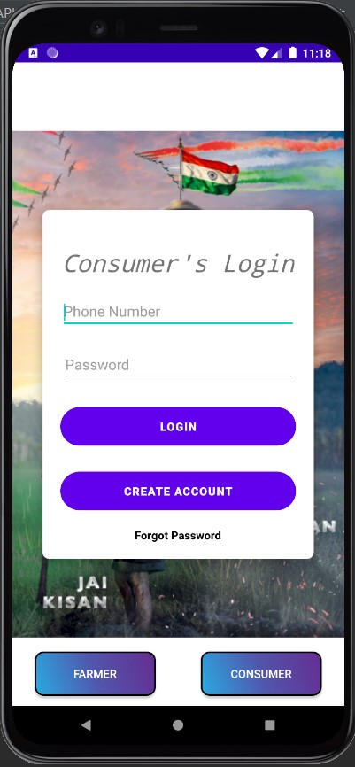

# Jai-kisan-farmers-networking-app
  This Application focuses on building an online profile for farmers, showcase their inventory online, and attract end-consumers and build business with them as a side business.
  
  Also End-consumers and entrepreneurs based on agriculture goods and services can get direct contact with farmers and promote their business and generate profit.
  
  Mission: Platform for farmers to be financially independent, generate profit and contribute directly to the Nation's GDP, instead of relying only on Middlemen and the demand-supply governing bodies.

**Login Views:**  
 
  
 **Create Account Views:** 
  
 **Farmer's Dashboard** 
     
 **Firebase RealTime DataBase Dashboard** 
  

